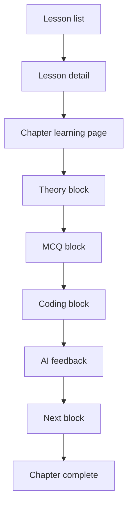
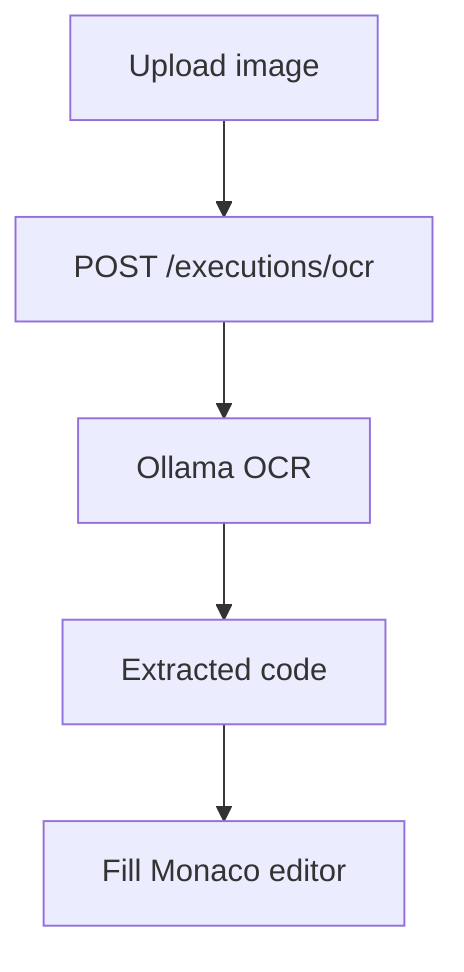

# Lessons Architecture

## Folder Structure

```
app/
  (app)/
    lessons/
      page.tsx
      [slug]/page.tsx
    chapters/
      [id]/page.tsx
components/
  lessons/
    LessonCard.tsx
    ChapterRow.tsx
    LessonSidebar.tsx
    blocks/
      TheoryBlock.tsx
      MCQBlock.tsx
      CodingBlock.tsx
lib/
  api.ts
  stores/
    lesson-store.ts
backend/
  src/
    modules/
      lessons/
      chapters/
      progress/
      executions/
    config/
      prisma.ts
  prisma/
    schema.prisma
```

## Prisma Schema Overview

Core entities for the lessons flow are in schema.prisma:
- User, Lesson, Chapter, LessonBlock
- MCQQuestion, CodingChallenge
- UserProgress
- CodeExecution, AIReview
- XPHistory, Streak

## Backend API Architecture

- lessons
  - GET /api/lessons?languageId=
  - GET /api/lessons/slug/:slug
- chapters
  - GET /api/chapters/:id
- progress
  - GET /api/progress/lesson/:lessonId
  - POST /api/progress/chapters/:chapterId/block
  - POST /api/progress/chapters/:chapterId/complete
- executions
  - POST /api/executions/run
  - POST /api/executions/ocr

Execution queue uses BullMQ + Redis when configured. Without credentials, responses are stubbed for local UI flow.

## Frontend Page Architecture

- Lessons hub: filterable, searchable list across languages
- Lesson detail: chapter list with prerequisites, progress sidebar
- Chapter learning page: one active block at a time, with AI feedback and output terminal

## Component Breakdown

- LessonCard: summary tile with progress + XP
- ChapterRow: chapter list item with lock/completion state
- LessonSidebar: sticky progress summary
- TheoryBlock: markdown lesson content
- MCQBlock: quiz with validation
- CodingBlock: Monaco editor + OCR upload + execution feedback

## State Management

- React Query: data fetching/caching for lessons/chapters
- Zustand: in-session block progress and current block

## API Route Structure

```
GET  /api/lessons
GET  /api/lessons/slug/:slug
GET  /api/chapters/:id
GET  /api/progress/lesson/:lessonId
POST /api/progress/chapters/:chapterId/block
POST /api/progress/chapters/:chapterId/complete
POST /api/executions/run
POST /api/executions/ocr
```

## Database Relationships

- Language 1..* Lesson
- Lesson 1..* Chapter
- Chapter 1..* LessonBlock
- LessonBlock 0..1 MCQQuestion
- LessonBlock 0..1 CodingChallenge
- User 1..* UserProgress
- User 1..* CodeExecution 1..1 AIReview
- User 1..* XPHistory
- User 1..1 Streak

## Execution Flow Diagrams

### Learning Flow



### OCR + AI Extraction



### Code Execution

```mermaid
graph TD
  A[Run code] --> B[POST /executions/run]
  B --> C[Queue job (BullMQ)]
  C --> D[Judge0]
  D --> E[Store CodeExecution]
  E --> F[AIReview feedback]
```

## Production Architecture Notes

- Use Redis-backed BullMQ workers for Judge0/Ollama calls
- Cache lesson/chapters with HTTP caching + React Query
- Secure uploads with pre-signed storage (S3/Blob)
- Rate-limit execution endpoints and OCR
- Track XPHistory and Streak updates in transaction
